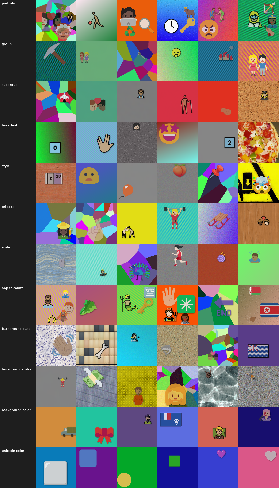

# Synthetic Self Supervised Learning

We generate synthetic datasets using emojis and complicated backgrounds.

Current Findings (based on online linear probing):
1. Supervised learning does work and train on the generated dataset, but self supervised learning is challenging to apply with low linear probing accuracy.
2. There is a gap between backbone and projector performance (see guillotine regularization).
3. Instead of only invariance, f(g(z_1, t), z_2) where f is the objective, g is the transformation predictor, t is the transformation parameters, and z are the latent representations does work to some degree. Technically, the ideal case is probably some version of "Self-supervised Transformation Learning for Equivariant Representations" where they used a projector for invariance, one for equivariance, and one for transformation. In my opinion, I don't believe in the transformation projector (paper ablation studies show so too), and the paper showed that the equivariance one is best (the method implemented here is different though).
    - I wonder if we apply augmentations to a specific location on the image, will it be able to train just based on that.
4. Adding a blurry reconstruction objective does not create a noticeably better latents for linear probing.



---

## 1. Source assets

### 1.1 Objects (foreground)

Five emoji rendering styles, all keyed on Unicode hexcode so one identity indexes all five. All are SVG-based so each renders cleanly at any size via `cairosvg` (no bitmap-font size locking).

| Source | License | Location | Files |
|---|---|---|---|
| OpenMoji | CC-BY-SA 4.0 | `src/OpenMoji/openmoji-svg-color/` | ~4,500 SVGs, uppercase hex dash-separated |
| Noto Emoji | OFL | `src/noto-emoji/svg/` | ~3,700 SVGs, lowercase hex underscore-separated |
| Fluent Emoji (Flat) | MIT | `src/fluentui-emoji/assets/*/Flat/` | ~1,600 SVGs, indexed via `metadata.json` |
| Twemoji (jdecked fork) | CC-BY 4.0 | `src/twemoji/assets/svg/` | ~3,700 SVGs, lowercase hex dash-separated |
| Blobmoji | Apache-2.0 | `src/blobmoji/{svg,svg15,derived}/` | ~2,700 SVGs, mixed hex + human-named |

Hierarchy (Unicode CLDR via `emoji-test.txt`): `group → subgroup → emoji`. **9 groups / 98 subgroups / 3,944 fully-qualified emojis** (1,943 unique base_hex after skin-tone collapse). Full hierarchy, per-style availability flags, derived attribute tags (has_face / is_living / is_vehicle / is_food), and codepoint-count live in `src/SynthSSL/hierarchy.json`, built by `scripts/build_hierarchy.py`.

Per-style availability against the 3,944-emoji corpus (file-level checks, not assumed):

| Style | Available | % |
|---|---|---|
| OpenMoji | 3,737 | 94.8% |
| Noto | 2,502 | 63.4% |
| Fluent | 1,595 | 40.4% |
| Twemoji | 3,724 | 94.4% |
| Blobmoji | 2,706 | 68.6% |
| In all 5 | 1,232 | 31.2% |
| In ≥3 | 2,960 | 75.0% |

Implications:

- Pretrain samples any emoji with any of its available styles → all 3,944 are usable, with rich style diversity where it exists.
- `probe/style` (5-way balanced) draws only from the 1,232-emoji intersection so every class is equally represented.
- Non-intersection emojis stay in the dataset but their appearance in style-sensitive probes is gated by the `available` flags.

### 1.2 Backgrounds — two independent layers

Background is a composite of a **base** layer and an optional **noise** layer. Both carry independent labels that enable two separate probes. Objects are always rendered on top of the finished background composite and never partially obscure it — but the background can partially obscure itself via noise modulation.

**Base layer** — fully covers the canvas, one of:

| Kind | License | Count | `base_category` values |
|---|---|---|---|
| ambientCG | CC0 | ~2000 | 95 material categories (`Wood`, `Bricks`, `PavingStones`, …) |
| Procedural structured | N/A | infinite | `solid`, `gradient`, `perlin`, `voronoi`, `gabor` |

**Noise layer** — optional modulation applied on top of the base, pixel-wise. `noise_type` ∈ `{none, gaussian, laplacian, uniform, salt-pepper, pink}`. Strength is sampled per scene (`noise_strength` stored in metadata) and **bounded so the base background remains legible** — noise is modulation, never replacement of the signal.

Per-type strength ranges (σ / rate chosen so a human still recognizes the base category after noise is applied; pixel values in [0, 1] throughout):

| Type | Parameter | Sampling range | Blend |
|---|---|---|---|
| `gaussian` | σ | Uniform(0.02, 0.12) | additive, clamp to [0, 1] |
| `laplacian` | scale `b` | Uniform(0.02, 0.10) | additive, clamp to [0, 1] |
| `uniform` | half-width | Uniform(0.03, 0.15) | additive, clamp to [0, 1] |
| `salt-pepper` | impulse fraction | Uniform(0.002, 0.03) | replacement (0 or 1 per-impulse) |
| `pink` | overall gain | Uniform(0.05, 0.20) | additive, clamp to [0, 1] |

Explicitly excluded: noise strengths that fully whiteout the base (σ > 0.3 for additive, > 5% impulse for salt-pepper). Rule of thumb: after noise, the base's per-category color histogram should still be distinguishable from other categories with high probability — we check this by generating a small diagnostic grid at recipe-time.

- `gaussian` — i.i.d. Normal(0, σ). Peaky histogram, short tails.
- `laplacian` — i.i.d. Laplace(0, b). Heavier tails than Gaussian.
- `uniform` — i.i.d. Uniform(-w, w). Flat histogram, hard range bounds.
- `salt-pepper` — sparse impulse: most pixels unchanged, a small fraction set to 0 or 1.
- `pink` — 1/f spectrum (spatially correlated). Looks like soft clouds — very different from white noise despite matching marginals.

**Resulting probe targets**:

- `probe/background-base`: **100-way** (95 ambientCG + 5 structured procedural)
- `probe/background-noise`: **6-way** (the noise types including `none`)

Both are classified from scenes that contain an object on top (see §5.2) — testing whether the representation separates foreground semantics from background structure.

---

## 2. Per-sample pipeline (single unified composition)

Every scene — pretrain or probe — follows the same layered pipeline with the same sampling ranges. Probes override only the constraints flagged in §5 (typically object count); everything else samples freely per scene.

Strict z-order, bottom → top. Each layer is composed and "frozen" before the next draws, so **no later layer ever covers an earlier emoji** — objects are always fully visible on top of the finalized background.

1. **Base background** — fills the canvas at full opacity. Source sampled uniformly across:
   - ambientCG tile (95 material categories: Wood, Bricks, PavingStones, …)
   - Procedural structured: `solid`, `gradient`, `perlin`, `voronoi`, `gabor`
2. **Noise overlay** — per-pixel modulation. Applied with probability `p_noise = 0.5`; otherwise `noise_type = "none"`. When applied, `noise_type` is sampled uniformly from `{gaussian, laplacian, uniform, salt-pepper, pink}` with strength from the per-type ranges in §1.2.
3. **Anchor emoji** — guaranteed present. Style sampled uniformly from its `available` set. `scale_px`, `position_xy`, `alpha`, optional drop shadow and color harmonization per the sampling table below.
4. **Clutter emojis** — `N − 1` additional objects. `N` is sampled uniformly from `{1, 2, 3, 4, 5}` (so scenes range from a single anchor to 5 objects total). Each clutter emoji has independent style / scale / position / alpha. Placed in order with non-overlap rejection (§2.0). All objects fully on-canvas.

Objects are not rotated — no canonical "up" exists for many emojis (abstract shapes, fruits, symbols), so a rotation label would be ill-defined.

Drop shadows and color harmonization affect each object's own pixels only — never pixels outside its bounding box.

Final: JPEG encode at q=90. No training-time augmentation applied here.

### Per-object sampling ranges

Same ranges used for anchor and clutter.

| Parameter | Distribution |
|---|---|
| `style` | uniform over emoji's `available` set |
| `scale_px` (short side) | Uniform(100, 320) |
| `position_xy` | Uniform in `[0, 1]²`, clipped so bbox stays on-canvas |
| `alpha` | Uniform(0.85, 1.0) |
| drop shadow | applied with p=0.5 (blur σ ∈ [3, 6] px, offset (3, 4) px, opacity 0.5) |
| color harmonization | applied with weight Uniform(0.0, 0.2) toward background dominant color |

### 2.0 Placement constraint

Non-overlap is enforced via axis-aligned bounding-box rejection: for each new object, draw a random `(position_xy, scale_px)` and check `bbox_iou(new, existing) == 0` against every already-placed object. Retry up to K=50 times; if still failing, shrink the target `scale_px` by 0.85× and retry. For canvas=512 with `scale_px ∈ (100, 320)` and `N ≤ 5` there's always room.

### 2.1 Per-sample metadata (JSONL sidecar)

Every factor a probe could want is written out.

```json
{
  "image_path": "pretrain/000123.jpg",
  "seed": 123,
  "anchor_index": 0,
  "objects": [
    {
      "hex": "1f436",
      "base_hex": "1f436",
      "group": "Animals & Nature",
      "subgroup": "animal-mammal",
      "name": "dog face",
      "style": "openmoji",
      "position_xy": [0.32, 0.71],
      "scale_px": 196,
      "alpha": 0.95
    }
  ],
  "background": {
    "base_source": "ambientcg",        // or "procedural"
    "base_id": "Bricks077",            // ambientCG asset ID, or null for procedural
    "base_category": "Bricks",         // one of 95 ambientCG cats + 5 procedural names
    "noise_type": "gaussian",          // {none, gaussian, laplacian, uniform, salt-pepper, pink}
    "noise_strength": 0.12,            // 0.0 when noise_type=none
    "color_bucket": null               // one of the 10 palette buckets when base="solid", else null
  }
}
```

`base_category`, `noise_type`, and `color_bucket` are the three background probe targets. `color_bucket` is only non-null when the background was generated by the solid-color palette path (used by `probe/background-color`). `anchor_index` + `objects` expose every foreground factor. Hierarchy fields like `base_hex`, `codepoint_count`, and `attributes` remain in `hierarchy.json` for downstream use but aren't currently probed.

---

## 3. Fixed constants (across all recipes and probes)

| Parameter | Value |
|---|---|
| Canvas (on disk) | 512 × 512 |
| Model input (`train.py --image-size`) | 128 × 128 |
| File format | JPEG q=90 |

Canvas=512 is chosen so `train.py`'s default `RandomResizedCrop(scale=(0.08, 1.0))` at `image_size=128` runs without upsampling at non-extreme aspect ratios (min canvas ≈ 128 / √0.08 ≈ 452). Bump to 640 if using more aggressive crops.

All per-scene parameters (object count, object size, background source, noise, shadow/harmonization) are sampled per §2 with no complexity tiers — one unified distribution for every scene.

---

## 4. Recipes

Per-emoji anchoring: each of the 3,944 fully-qualified Unicode emojis gets `K` "anchor" images where it is **guaranteed to appear**. Other emojis present in the same scene (drawn from the clutter pool) contribute bonus appearances — every emoji ends up in at least `K` images, often more. This guarantees class balance at every hierarchy level without rejection sampling.

Two recipes, same structure, different `K`:

| Axis | **Small (K=10, dev)** | **Large (K=50, production)** |
|---|---|---|
| Anchor images per emoji | 10 | 50 |
| Total pretrain images | 10 × 3,944 = **39,440** | 50 × 3,944 = **197,200** |
| Per-scene composition | full §2 pipeline, unified distribution | same |
| Probe datasets | identical across recipes (§5) | identical |
| Disk size (pretrain, JPG q=90) | ~2 GB | ~10 GB |
| Generation time (1 worker) | ~20 min | ~1.5 hr |
| Generation time (8 workers) | ~3 min | ~12 min |

**Probe viability by recipe** (anchor count × 3,944 emojis → per-class samples at each hierarchy level):

| Probe | Small (K=10) | Large (K=50) |
|---|---|---|
| Group (9 classes) | ~4k/class — excellent | ~22k/class — excellent |
| Subgroup (98 classes) | ~400/class — good | ~2k/class — excellent |
| Leaf (~3,944 classes) | 10/class — too few, skip | ~50/class — usable |
| Geometry / style / count / background | scale with total images — plenty either way | plenty |

Both recipes share the same probe directory, so results from a K=10 run and a K=50 run are directly comparable.

---

## 5. Evaluation — per-task probe datasets

SynthSSL has **two kinds of datasets**, cleanly separated:

- **Pretrain** (§4) — one unlabeled dataset. Used by the SSL loss; images only, metadata is informational. The trainer never reads labels.
- **Probe** — one **independent dataset per probe task**. Each task directory is a self-contained evaluation dataset: its own images, its own train/test split, its own labels. No sharing of images between tasks.

Per-task images are regenerated for each task using that task's scene spec. Tasks with the same scene spec (e.g. `group` and `subgroup`) produce different images — independent generation runs, independent seeds. This duplicates some generation cost but keeps each task a standalone drop-in dataset — loading `data/probe/group/train/` gives you a classifier-ready dataset with zero cross-references.

### 5.1 Per-task spec

Each row below defines one probe-task dataset. All datasets use the full §2 composition pipeline with the **scene spec** column overriding the object-count distribution when listed; everything else (background, noise, object sizes, shadows, style sampling) is sampled per §2.

Samples per task = 3,000, split 80/20 into train/test. 10 tasks × 3,000 = **30k images**, ~1.5 GB at 512² JPG q=90.

**Notation**: `obj = objects[anchor_index]`. When the scene spec requires a single foreground, `anchor_index=0` and `len(objects)=1`.

All probes are classification. No regression targets. Scalar factors (position, scale) are bucketed into fixed-size class sets.

| Task | Target (label extraction from metadata) | Scene spec | Probe type | Classes |
|---|---|---|---|---|
| group | `obj.group` | 1 object | linear / KNN | 9 |
| subgroup | `obj.subgroup` | 1 object | linear / KNN | 98 |
| leaf | `obj.hex` | 1 object (Large recipe only; skip for Small) | linear / KNN | ~3,944 |
| base_leaf | `obj.base_hex` | 1 object | linear / KNN | ~1,943 |
| style | `obj.style` | 1 object; emoji from 5-style intersection; styles cycled to balance | linear / KNN | 5 |
| grid3x3 | `position_xy` binned 3×3 | 1 object | linear | 9 |
| scale | `obj.scale_px` binned into 10 equal-width bins over `[100, 320]` | 1 object | linear | 10 |
| object-count | `len(objects)` | 1–5 objects, count uniform | linear | 5 |
| background-base | `background.base_category` | 1 object (robustness: read background through a distractor) | linear / KNN | 100 |
| background-noise | `background.noise_type` | 1 object | linear | 6 |
| background-color | `background.color_bucket` | 1 object; background forced to **solid** source, color drawn from a 10-bucket palette; noise overlay disabled | linear | 10 |

Special case — **leaf** task (3,944-way): 3,000 samples ≪ 3,944 classes. Not generated as a standalone probe dataset; instead runs on the **pretrain dataset itself** (K=50 gives ~50 samples/class via anchor labels). Skipped entirely on K=10.

### Color palette for `background-color`

Ten buckets chosen for mutual discriminability in HSV. Each bucket is a sampling region in HSV-space; the sampler draws a solid RGB within it and tags the sample with the bucket name.

| Bucket | H (°) | S | V |
|---|---|---|---|
| red | 0–20 or 340–360 | 0.6–1.0 | 0.6–1.0 |
| orange | 20–45 | 0.7–1.0 | 0.7–1.0 |
| yellow | 45–70 | 0.6–1.0 | 0.8–1.0 |
| green | 70–160 | 0.5–1.0 | 0.4–0.9 |
| cyan | 160–200 | 0.5–1.0 | 0.6–1.0 |
| blue | 200–250 | 0.5–1.0 | 0.4–0.9 |
| purple | 250–290 | 0.4–0.9 | 0.4–0.9 |
| pink | 290–340 | 0.3–0.7 | 0.8–1.0 |
| brown | 15–40 | 0.4–0.7 | 0.2–0.5 |
| gray | any | 0.0–0.1 | 0.3–0.7 |

Bucket membership is **mutually exclusive by construction** — each region is sampled uniformly within its bounds, and the label is the bucket name (not the RGB), so there's no overlap ambiguity at label time. The probe target is `background.color_bucket` which the compositor writes to metadata when the task is `background-color`.

### 5.2 On-disk layout

```
data/
  pretrain/                      # §4 — one unlabeled dataset for SSL
    000000.jpg                   # images
    000001.jpg
    …
    metadata.jsonl               # informational; trainer doesn't read it

  probe/                         # §5 — one self-contained dataset per task
    group/                       (9-way)
      train/
        000000.jpg
        …
      test/
        000000.jpg
        …
      metadata.jsonl             # labels + full per-sample metadata
    subgroup/                    (98-way)
    base_leaf/                   (~1,943-way)
    style/                       (5-way, balanced)
    grid3x3/                     (9-way position)
    scale/                       (10-way scale bins)
    object-count/                (5-way: 1–5 objects)
    background-base/             (100-way material)
    background-noise/            (6-way noise type)
    background-color/            (10-way solid color palette)
    # leaf probe uses pretrain/ directly; no separate directory.
```

Every `probe/<task>/` is a complete classifier-ready dataset: iterate the `train/` directory, look up each filename in `metadata.jsonl`, read the `label` field (determined by the task's target extraction rule). Nothing points outside the task directory.

### 5.3 Design notes

- **All tasks are classification**. Continuous factors (position, scale) are bucketed into fixed class sets. This simplifies probe training (all tasks look identical to the probe head) and sidesteps regression-metric noise for factors with tight bounded ranges.
- **Images regenerated per task, not shared.** A single-object scene rendered for `probe/group/` is a different image from one rendered for `probe/subgroup/`. Costs extra generation wallclock; keeps every task standalone. At ~30k total images ≈ 1.5 GB disk.
- **Leaf probe exception**: uses the pretrain dataset directly rather than a separate probe split, since ~3,944 classes need pretrain scale.
- **`background-*` tasks have 1 object, not 0**: these are robustness probes — can the representation read the background *while* ignoring a foreground distractor?
- **`background-color` is the color probe.** Direct color probing on arbitrary emojis is confounded with identity (each emoji has inherent colors). Instead, we control color as a *background* variable: solid colored background with any emoji on top as distractor, probe the background's 10-bucket color. Noise overlay is disabled for this task so the color label is unambiguous.
- **Style balance**: for `probe/style`, the emoji pool is restricted to the 1,053-emoji five-style intersection and styles are cycled so each of the 5 styles is equiprobable — otherwise the 5-way target would be imbalanced (Noto / OpenMoji / Twemoji have ~2× the coverage of Fluent / Blobmoji).

---

## 6. Generator CLI (target)

```
python -m SynthSSL.generate \
  --recipe {10k,50k,500k} \
  --out data/ \
  --workers 8 \
  --seed 0
```

Generates pretrain + all probe splits into `data/`. Deterministic under `--seed`. Probe splits don't depend on recipe — if they already exist, they're skipped unless `--regen-probes` is passed.
